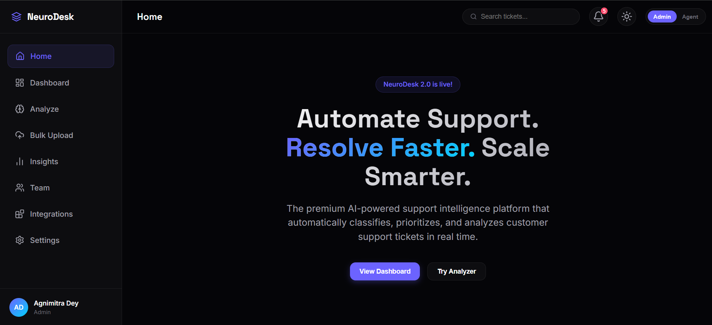

# 🧠 NeuroDesk



An AI-powered customer support ticket classification system that automatically categorizes support tickets, predicts priority levels, and visualizes support analytics to help businesses improve response time and customer satisfaction.

---

## 🚀 Live Demo

🔗 https://future-ml-02-wkrw.vercel.app/

---

## ✨ Features

- 🎫 AI-powered ticket classification
- 🚨 Automatic priority prediction
- 📊 Interactive analytics dashboard
- 📈 Ticket statistics visualization
- 📂 Category-wise issue management
- ⚡ Fast and responsive user interface
- 📱 Responsive design

---

## 🛠 Tech Stack

- HTML5
- CSS3
- JavaScript (ES6)
- Chart.js
- Vercel

---

## 📂 Project Structure

```
NeuroDesk
│
├── neurodesk/
│   ├── css/
│   │   └── main.css
│   ├── js/
│   │   ├── app.js
│   │   ├── classifier.js
│   │   ├── charts.js
│   │   ├── data.js
│   │   └── pages/
│   └── index.html
│
├── vercel.json
└── README.md
```

---

## ⚙️ Installation

### Clone Repository

```bash
git clone https://github.com/debraniprl-wq/NeuroDesk.git
```

### Open Project

Simply open `index.html` in your browser.

Or use VS Code Live Server.

---

## 🎯 Use Case

This project demonstrates how Artificial Intelligence concepts can improve customer support by automatically:

- Classifying incoming support tickets
- Predicting issue priority
- Organizing support requests
- Visualizing ticket analytics

---

## 🚀 Future Improvements

- 🤖 Real machine learning model integration
- 🗄 Database support
- 🔐 User authentication
- ☁ Cloud backend integration
- 📧 Email notifications
- 🌙 Dark mode
- 📊 Advanced analytics

---

## 👩‍💻 Author

**Agnimitra Dey**

GitHub: https://github.com/debraniprl-wq

---

⭐ If you found this project helpful, consider giving it a star!
